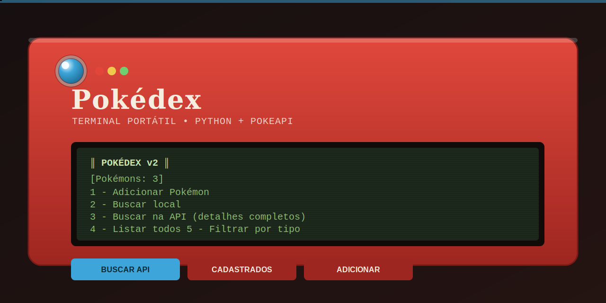

<p align="center">
  
</p>

<h1 align="center">Pokédex em Python</h1>

<p align="center">
  Uma Pokédex de terminal, feita inteiramente em Python, com cadastro local persistente e integração com a <a href="https://pokeapi.co">PokeAPI</a>.
</p>

---

## Sobre o projeto

Esse é um sistema de cadastro e consulta de Pokémon rodando via terminal. Você pode manter sua própria lista local (salva em JSON) e também consultar dados oficiais em tempo real na PokeAPI — estatísticas base, tipos, habilidades, descrição, cadeia de evolução e comparação entre dois Pokémon.

Projeto criado para praticar lógica de programação, consumo de APIs REST e estruturas de dados em Python.

## Funcionalidades

- Adicionar Pokémon manualmente ou importando direto da PokeAPI
- Buscar Pokémon cadastrados localmente
- Buscar Pokémon na PokeAPI com estatísticas, habilidades, descrição e evolução
- Listar todos os Pokémon cadastrados
- Filtrar Pokémon cadastrados por tipo
- Comparar as estatísticas de dois Pokémon
- Remover Pokémon da lista local
- Persistência automática em `pokedex_save.json`

## Como executar

### 1. Clonar o repositório

```bash
git clone https://github.com/TheoGoulart333/pokedex.git
cd pokedex
```

### 2. Instalar as dependências

```bash
pip install -r requirements.txt
```

### 3. Rodar o programa

```bash
python pokedex.py
```

## Exemplo de uso

```
╔══════════════════════════╗
║        POKÉDEX v2        ║
╚══════════════════════════╝

  [Pokémons: 3]
  1 - Adicionar Pokémon
  2 - Buscar local
  3 - Buscar na API (detalhes completos)
  4 - Listar todos
  5 - Filtrar por tipo
  6 - Comparar dois Pokémons
  7 - Remover Pokémon
  8 - Sair
```

## Estrutura do repositório

```
pokedex/
├── pokedex.py          # programa principal
├── requirements.txt    # dependências (requests)
├── .gitignore
├── README.md
└── assets/
    └── banner.png
```

## Tecnologias utilizadas

- **Python 3**
- **[requests](https://pypi.org/project/requests/)** — chamadas HTTP para a PokeAPI
- **[PokeAPI](https://pokeapi.co)** — dados oficiais dos Pokémon

## Conceitos de programação utilizados

- Dicionários e listas em Python
- Funções e organização em módulos
- Estruturas condicionais e de repetição
- Consumo de API REST com tratamento de erros
- Persistência de dados em JSON
- Type hints (`Optional`, `dict`, `list[str]`)

## Possíveis melhorias futuras

- Interface gráfica (Tkinter ou web)
- Testes automatizados
- Suporte a múltiplos idiomas na descrição
- Cache local dos dados da API

## Autor

Desenvolvido por **Theo Vasconcelos** para fins de estudo em Python e lógica de programação.

Se você gostou do projeto, considere deixar uma estrela no repositório.
